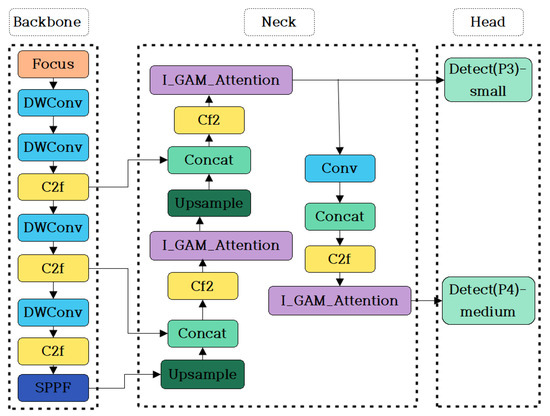
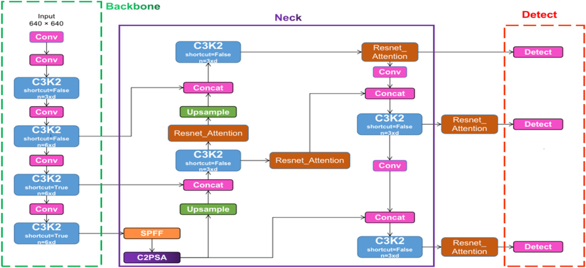

# TIDE: A New Computer Vision Model for Detecting Phytopathologies on Tomato (*Solanum lycopersicum* L.) Leaves

## Authors
- A. Galimov (Institute of Animal and Plant Ecology, Ekaterinburg)
- N. Sheludyakov (Institute of Cytology and Genetics SB RAS, Novosibirsk)
- K. Borodin (Novosibirsk State University)
- A. Panshin (IITP RAS color reproduction lab, Moscow)

## Abstract
Tomato is one of the most important crops worldwide. Due to its high nutritional and economic value, it is grown in large quantities in various regions. However, like other crops, tomatoes are susceptible to a number of diseases that can pose serious problems for production. Early detection and timely response to disease symptoms are crucial to reduce crop losses and prevent spoilage. To address this challenge, computer vision methods have shown great success in object detection and classification tasks. This study proposes TIDE (Tomato Image Disease Evaluation), a model for recognizing tomato leaf lesions, based on the trained (either DETR or YOLO).

**Index Terms:** Machine learning, Disease Detection, Computer Vision

## 1. Introduction and Related Work
Tomatoes (*Solanum lycopersicum* L., as they are known today *Solanum* sect. *Lycopersicon* [1]) have been domesticated and used by humans for at least 7,000 years[2]. According to FAOSTAT, in 2023, 192.3 million tons of tomatoes were produced in the world (2% of the total production of plant products), with China producing 36.5% of the world production, and Russia 1.4%. For China, the share of tomato production from other products is 3.6%, and in Russia 3%, which shows the importance of tomatoes for consumers in these countries[3].

Throughout the tomato growth cycle, a wide variety of diseases and pests can affect plants, making accurate identification and diagnosis essential for crop preservation[4,5]. Traditionally, disease detection in tomatoes begins with visual inspections: agronomists identify symptoms and determine the specific disease[6]. However, this approach requires significant expertise and time, making it difficult to scale in large-scale agricultural settings.

Modern advances in machine learning and deep learning—especially convolutional neural networks (CNNs)—have led to automated methods for image-based disease detection and classification. Models such as VGG-16[6] and TomatoGuard-YOLO[7] have demonstrated their effectiveness for these tasks. More recently, transformer-based architectures, initially developed for natural language processing, have been successfully adapted for image analysis, with models like Swin-DDETR showing strong performance[8].

**Objective:** To train and compare the performance of seven image recognition models for identifying tomato diseases.

## 2. Methods

### a. Data Collection
For evaluating the performance of our models, we used the Tomato Disease dataset [9]. The dataset contains 5,573 RGB images of tomato leaves, each with a resolution of 640×640 pixels. The training set consists of 4,692 images, the validation set includes 438 images, and the test set contains 443 images. Each image may feature one or several tomato leaves. The dataset includes leaves belonging to four classes: *blight*, *healthy*, *leaf-miner*, *septoria_leaf_spot*.

### b. Architecture YOLOv8
YOLOv8 introduces several improvements over previous YOLO versions to boost accuracy, speed, and generalization.

It replaces the C3 modules in the backbone with C2f modules, which concatenate the outputs from all bottleneck blocks. This design improves gradient flow and accelerates training while reducing computational cost.

The model adopts an anchor-free detection mechanism, which eliminates predefined anchor boxes. Instead, it directly predicts object center points, improving performance on custom datasets and speeding up Non-Max Suppression (NMS).

A decoupled head is used for classification and bounding box regression, allowing better task specialization. To address possible misalignment between these outputs, YOLOv8 introduces a task alignment score—a product of classification confidence and IoU—which helps identify positive samples.

Loss functions include BCE for classification, CIoU for box regression, and DFL to focus on harder examples.

The model also uses mosaic data augmentation, blending four training images, which is disabled in the final training epochs to improve convergence.

### c. Architecture YOLOv11
YOLOv11 introduces a refined architecture designed to improve speed, efficiency, and detection accuracy, particularly for small and occluded objects.

The model is fully anchor-free, predicting object centers directly instead of relying on predefined anchor boxes. This reduces the number of proposals, speeds up non-maximum suppression, and increases small-object recall.

The traditional CSP bottleneck is replaced with a more efficient C3k2 module, which uses two depth-wise convolutions within a CSP structure. This reduces the number of parameters by around 20 compared to previous models, without compromising accuracy.

YOLOv11 integrates position-sensitive spatial attention through C2PSA modules at key fusion points, allowing the model to focus more effectively on salient regions in the image, improving detection under challenging conditions.

The head is decoupled into separate, lightweight branches for classification, box regression, and objectness, now built with optimized C3k2 and Conv-BN-SiLU (CBS) layers. This reduces latency and enhances compatibility with attention-enriched features.

For training, YOLOv11 uses a task-aligned strategy: Binary Cross-Entropy for classification, CIoU and Distributional Focal Loss for bounding box regression, and a combined confidence score (class score × IoU) for positive sample selection to maintain synchronization between classification and localization.

### d. Training Models
Training using the tomato leaf dataset, the following models YOLOv8 (versions -n, -m, -s), YOLOv11 (versions -n, -m, -s). The training parameters are as follows: 100 epochs, 8 batches, 4 workers. The training was conducted in the CoLab cloud computing environment.

## 3. Work Plan
1) Download dataset for phytopathology from [Roboflow](https://universe.roboflow.com/thesis-team-ana/tomato-disease-detection-izemp/browse?queryText=&pageSize=50&startingIndex=0&browseQuery=true)
2) Train YOLOv8 (there are several subversions n,s,m etc. the goal is to find the best option)
3) Train YOLOv11 (there are several subversions n,s,m etc. the goal is to find the best option)
4) From `transformers` library get [DetrForObjectDetection](https://huggingface.co/docs/transformers/v4.53.2/en/model_doc/detr#transformers.DetrForObjectDetection) and fit for this dataset.

## 4. Preliminary Results
The training results are presented in Table 1. Based on the comparisons, we can conclude that the largest and oldest model of the tested ones (YOLOv11m) is expected to cope with the task best of all. The next model in terms of efficiency is its smaller version (YOLOv11s). Then come YOLOv8m and YOLOv11n, despite the slight advantage of YOLOv8m, given the difference in the models (Table 2), the smaller model should be preferred. Within the framework of the considered models, it will be optimal to use YOLOv11m with unlimited computing resources or YOLOv11n in the case of limited resources.

**Table 1: Comparison of performance metrics of the tested models**

| Model       | Epochs | Precision | Recall | mAP@0.5 | mAP.5:.95 |
|-------------|--------|-----------|--------|---------|-----------|
| yolo11m.pt  | 100    | 0.84286   | 0.76546| 0.82039 | 0.61108   |
| yolo11s.pt  | 100    | 0.81742   | 0.75658| 0.81965 | 0.60206   |
| yolo8m.pt   | 85     | 0.83584   | 0.76237| 0.81646 | 0.59923   |
| yolo11n.pt  | 100    | 0.84017   | 0.74488| 0.81086 | 0.59524   |
| yolov8s.pt  | 100    | 0.85065   | 0.73652| 0.80963 | 0.60003   |
| yolov8n.pt  | 100    | 0.83273   | 0.74159| 0.80866 | 0.59813   |

**Table 2: Comparison of YOLOv8m and YOLOv11n models by key parameters**

| Parameter                     | YOLOv8m        | YOLOv11n       |
|-------------------------------|----------------|----------------|
| Number of parameters          | ~25-30 million | ~4-6 million   |
| Model size (file weight)      | 40-60 MB       | 5-10 MB        |
| Number of layers              | ~100+          | ~30-40         |
| Recommended input image size  | 640×640        | 320×320        |
| Inference speed (FPS on mid-range GPU) | ~30-50 FPS | ~70-100 FPS    |

For this training dataset, training over 85 epochs seems excessive, since the effect of overtraining of the models is observed (Fig. 1).

.png)

.png)

### Next Steps of Work
At the next stages of work it is planned to complete task 4 from those outlined above and conduct training on the transformer model. An increase in efficiency relative to already completed models is expected.

## References
[1] Grandillo, S., et al. "Solanum sect. Lycopersicon." Wild crop relatives: genomic and breeding resources: vegetables, 2011.  
[2] Razifard, H., et al. "Genomic evidence for complex domestication history of the cultivated tomato in Latin America." Molecular biology and evolution, 2020.  
[3] Food and Agriculture Organization of the United Nations. FAO, 2025.  
[4] Jones, J.B., et al. "Compendium of tomato diseases.", 1991.  
[5] Blancard, D. "Tomato diseases.", 2012.  
[6] Shanthi D L, et al. "Tomato Leaf Disease Detection Using CNN." Procedia Computer Science, 2024.  
[7] Wang, X., Liu, J. "TomatoGuard-YOLO: a novel efficient tomato disease detection method." Frontiers in Plant Science, 2024.  
[8] Vaswani, A., et al. "Attention Is All You Need." Advances in Neural Information Processing Systems, 2017.  
[9] Thesis Team ANA. "Tomato Disease detection Dataset." Roboflow Universe, 2024.  
[10] Dinh, H.T., Kim, E.T. "A Lightweight Network Based on YOLOv8 for Improving Detection Performance and the Speed of Thermal Image Processing." Electronics, 2025.  
[11] Ultralytics. "YOLOv8." GitHub, 2023.  
[12] Ultralytics. "YOLOv11." GitHub, 2025.  
[13] Hugging Face. "DetrForObjectDetection." Transformers Documentation, 2025.
